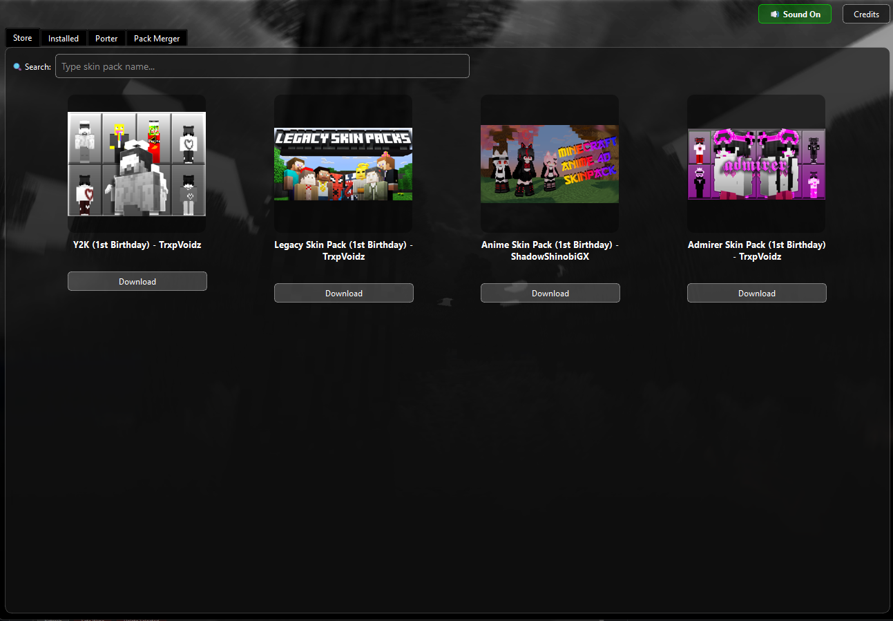
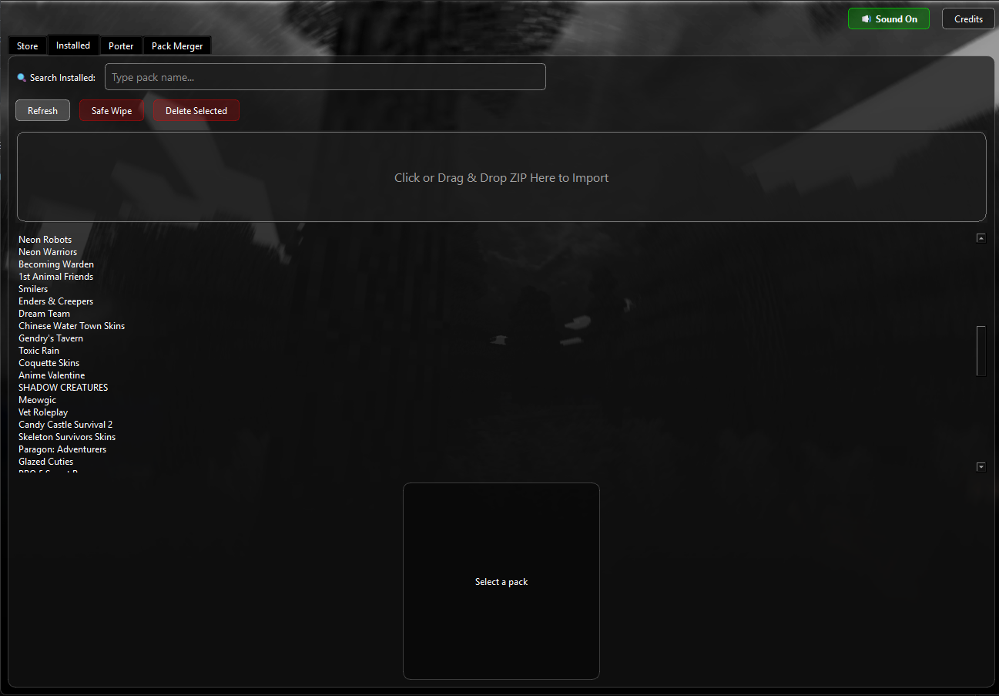
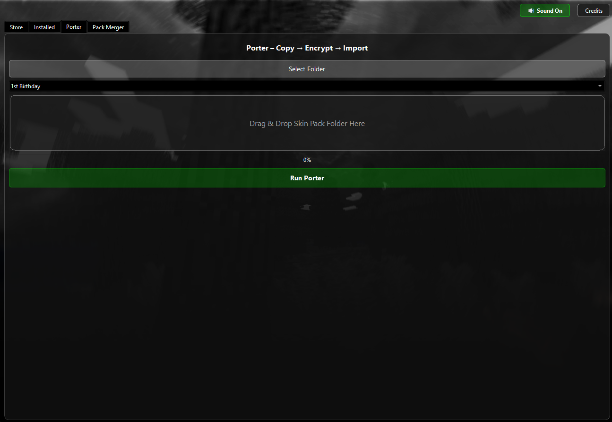
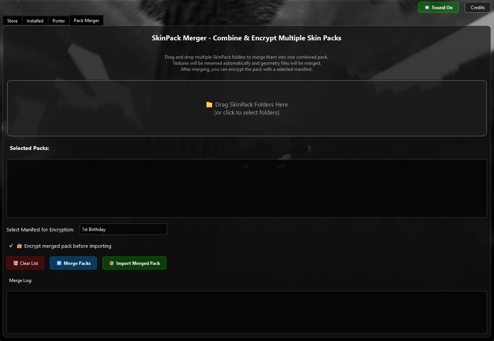

# 🖤Melancholy

Welcome to 🖤Melancholy – a multipurpose tool that makes importing/merging/porting packs easier than ever!

Download here: https://www.mediafire.com/file/573wsralmsglzwv/Melancholy_1.1.1.zip/file

## What can it do?

**Simple stuff:**
- 📦 Import skin packs just by dragging them in
- 🔄 Replace old packs without messing anything up
- 🧹 "Safe Wipe" removes everything cleanly

**Cool stuff:**
- 🏭 **Porter** – turn your packs into encrypted marketplace ones
- 🧩 **Pack Merger** – combine multiple packs into one
- 🛍️ **Community Store** – browse and download packs made by others

**Nice touches:**
- 🎵 Custom startup sound (if you want)
- 🖼️ See skin previews before installing
- 🎨 Clean design that's easy on the eyes
- 🔊 Hover and clicking noise on the button

## How stuff actually works (the simple version)

**When you import a pack:**
Melancholy looks for the pack's UUID in Minecraft's premium_cache folder. If it's new, it creates a folder with that UUID. Minecraft automatically scans this folder when it starts, so your pack just... appears. No modding, no messing with game files.

**The Porter tab:**
Minecraft marketplace packs are encrypted – the Porter takes your regular skin pack and runs it through the same encryption process that marketplace packs use. It adds those weird .dat files you see in premium_cache. The game treats it like you bought it, but you didn't. (Don't worry, it's just for testing your own creations!)

**Pack Merger:**
Ever wanted to combine your favorite skins from different packs? The merger renames all the texture files so nothing conflicts, merges the geometry files (those define how skins look), and gives you one big pack with everything. The skins keep their original look – they're just in one place now.

**The store:**
It's just a JSON file hosted on GitHub. When you open the Store tab, Melancholy grabs that file and shows you what's in it. Anyone can submit their pack to be added – it's community-run.

## Why use it?

Because managing skin packs manually is annoying. This just works. Drag, drop, done. No messing with folders or worrying about breaking anything.

## Quick start

1. Download the .exe
2. Run it
3. Start dragging packs in or browse the store

That's it. No installation, no setup, no headaches.

## Screenshots

*The community store - browse and download packs*

*The installed tab is where it shows all the packs installed in the folder*

*Convert packs to marketplace format*

*Combine multiple packs into one*

---

Made by TrxpVoidz (Ecliptix)  
Join our Discord: https://discord.gg/3x3M289anm
